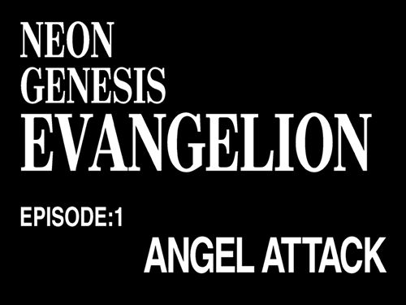

# Evangelion-404th-Impact
Simple Evangelion themed 404 page I came up with on random evening. You can try it [**here**](https://torusaynim.github.io/Evangelion-404th-Impact/)

Tried to make it as close as possible to the reference title card. Last line is clickable and meant to return user to the website homepage

Page should be adapted for most devices. If it doesn't please submit new issue mentioning used device and browser, or you can fix it yourselves and create new PR.
My only request is to keep the page a single file please

## Special thanks

These repositories helped me a lot with making this page and adapting it for different devices
